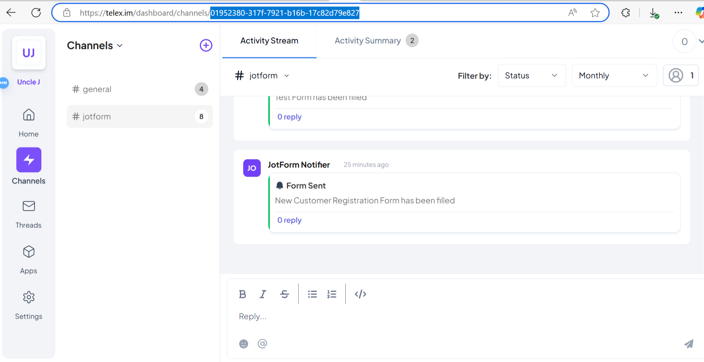
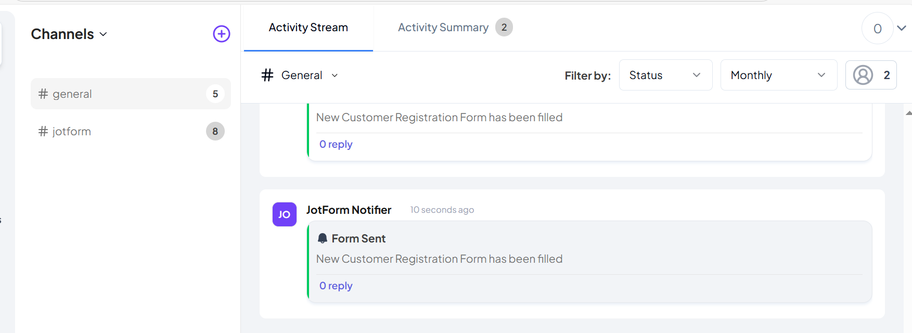

# JotForm Notifier

## Introduction

JotForm Notifier returns notifications to channels in telex when forms have been filled.

## Installation

1. Clone the repository:

```bash
git clone https://github.com/01kazu/telex-jotform.git
cd telex-jotform
```

2. Create a virtual environment:

```bash
python -m venv venv
source venv/bin/activate  # On Windows: venv\Scripts\activate
```

3. Install dependencies:

```bash
pip install -r requirements.txt
```

## Running the Application

1. Start the server:

```bash
uvicorn main:app
```

## API Endpoints
- `POST /ap1/v1/jotform-notify/"channel_id"` - sends notifications to designated telex channels
- `GET /api/v1/integration.json` - used to any integration on telex

## Running Tests

```bash
pytest
```

## Error Handling

The API includes proper error handling for:

- Wrong form title key from the Request object
- Failed Notifications


## USAGE
### How to connect this API to JotForm

1. Click on **Create Form** or **Edit Form**


2. Click on **Settings**


3. Click on **Integrations**
 


4. On the Search bar, type in "webhook"


5. In the Add WebHook input, paste "https://telex-jotform.onrender.com/jotform/"


6. To get your channel_id, click on a channel and copy the series of words and numbers



7. Then paste it, after "/" such that it would be arranged in the format "https://telex-jotform.onrender.com/jotform/01952380-317f-7921-b16b-17c82d79e827"


8. Click on **Complete Integration**


9. Congratulations!!!


10. When a form is submitted.


11. The title of the form is sent as a notification



